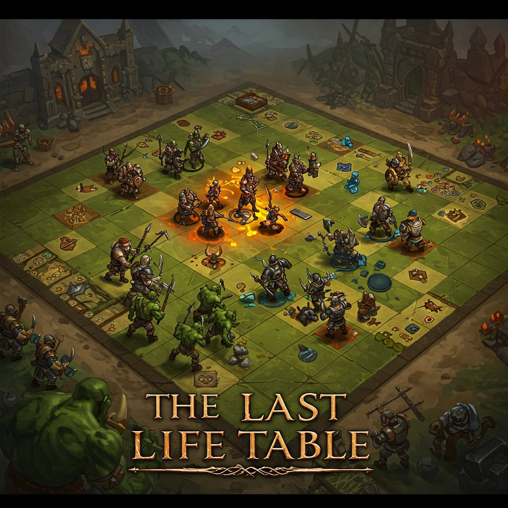

## ENTRY  
A school project made to better understand some important principles of the C language. A war game between humans and orcs, revolving around 10 predefined scenarios.

# PROJECT FEATURES  
*Reading data from Jason without library    
*Url reading with cURL library  
*Using SDL for graphics  

# INSTALLATION  
## 1. Requirements:  
*SDL library  
*cURL library  

## 2. Steps:  
**-SDL library installation**  
  First of all, you need to download the zip file that is suitable for your computer from the SDL official site.  
Then you need to copy the lip and bin files in the SDL file to your project file.
Finally, you need to add the paths of the lib and bin file paths required for the project file to the EDU you are using.  
**-cURL library installation**  
  First of all, you need to download the zip file that is suitable for your computer from the cURL official site.  
Then you need to copy the lip and bin files in the cURL file to your project file.
Finally, you need to add the paths of the lib and bin file paths required for the project file to the EDU you are using.  
**-Cloning the repository**  
  For HTTPS -> https://github.com/Alperen4105/The-Last_Life_Table.git  
  For SSH -> git@github.com:Alperen4105/The-Last_Life_Table.git  
**-Install dependencies**  
  For SDL and cURL  
**-Compile the code and run it**  
**NOTE: Do not forget to change the file paths for the images.**  

# USE OF  
If the installation is completed correctly, the terminal will open, and one of the 10 scenarios will be selected. Then, an SDL window will open, displaying the number of units before the battle. When the window is closed, a new window will open, showing the remaining units after the battle. The side with zero units will lose the war.  

# COMMUNICATION  
If you encounter a problem, you can contact us.  
-> **alperenplk.28@gmail.com**
-> **talhakkmz@icloud.fr**

